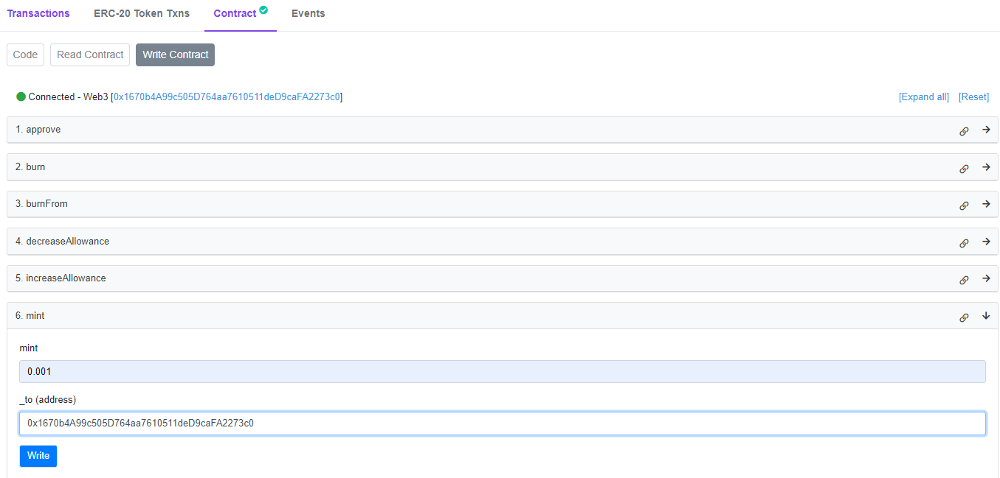
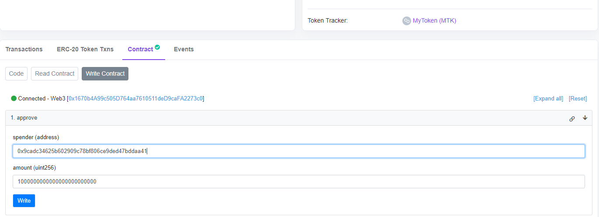
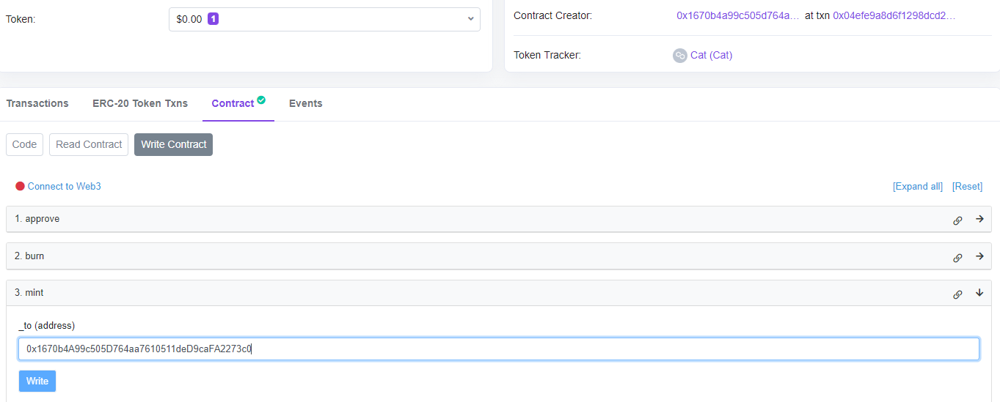
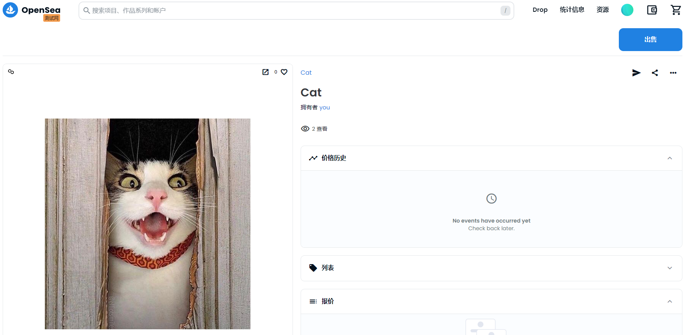

# ✏️Ed3Academy 之 Solidity 入门开发课程 👷

这是 Ed3Academy 系列课程中知识点实战演示代码。

通过这份文档，您将学会：

- 部署自己的 ERC20 通证；
- 上传资源到 IPFS；
- 创建自己的 NFT；
- 使用 ERC20 通证铸造出 NFT

## 🚧 在 Polygon Mumbai 网络上部署 MTK

💚 测试命令：

```
npx hardhat test ./test/MyToken.js
```

## ⚡ 在 Polygon Mumbai 网络上部署 NFT

🔥 上传图片到 IPFS 服务：

```
npx hardhat run ./scripts/upload-nfts.js
```

✒️ 使用 MTK 币 mint 出自定义 NFT

🚀 测试命令：

```
npx hardhat test ./test/mintNFTbyMTK.js
```

✅ 在 Polygon Mumbai 上部署 NFT

```
npx hardhat run ./scripts/deployNFTbyMTK.js --network PolygonMumbai
```

## ✨ 使用 MTK mint NFT

- 在 **[mumbai 网络](https://mumbai.polygonscan.com/)** mint MTK



- 授权 MTK 额度给 NFT 合约



- 在 NFT 合约中 mint 出 NFT



## 🎉 查看 NFT

在 OpenSea 上查看 mint 出的 NFT


